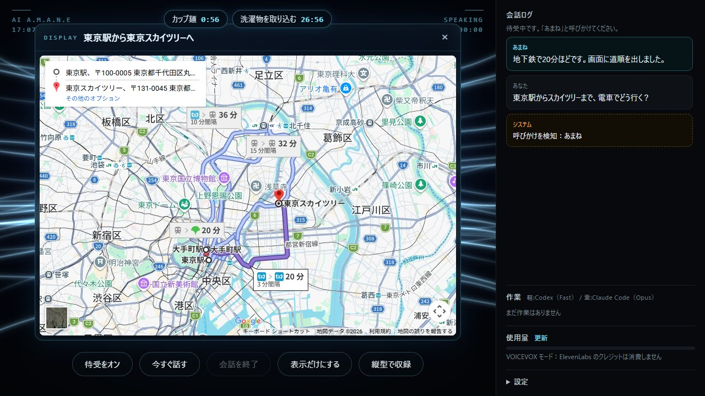
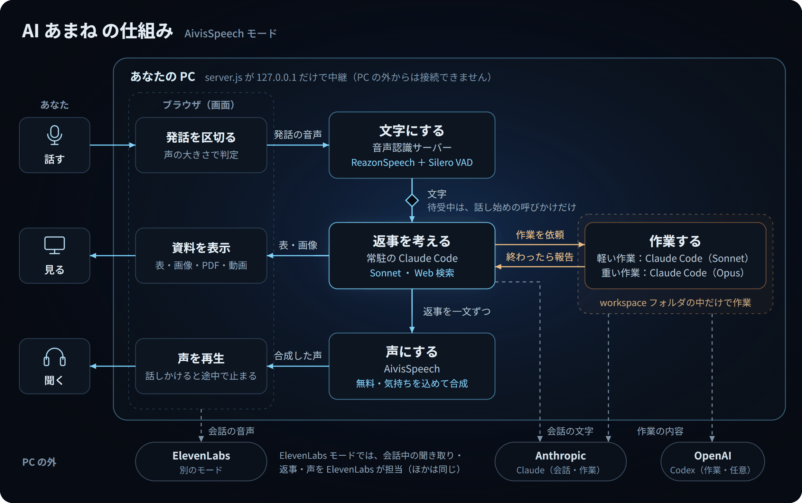

# AI あまね（ai-amane）


**呼びかけると声で応え、話しながら PC の作業もこなす、自分の PC で動く音声 AI エージェント** — v0.5.0

![AI あまね の画面。頼んだ BGM を YouTube で流しながら、カップ麺のタイマーの残り時間を画面の上に出しているところ（曲: Cartoon - On & On (feat. Daniel Levi) [NCS Release]）](docs/images/screenshot.jpg)

「あまね」と呼びかけると、空間に漂う光の粒子が反応して返事をします。雑談や相談の相手をしながら、「〇〇を作って」と頼めば、裏で Codex や Claude Code が作業をして、終わったら声で報告してくれます。

- **呼びかけで起動**して、そのまま声で会話（話の途中で割り込むこともできます）
- **気持ちのこもった声**: 感情豊かな AivisSpeech の声で、うれしい・やさしい・かなしい などの気持ちを文ごとに込めて話します
- **追加料金なし**（考えるのは Claude Code、声は PC の中で動く AivisSpeech）
- **作業の依頼**: ファイル作成やプログラム作成を Codex / Claude Code に任せ、終わったら声で報告
- **画面に資料を表示**: 表・画像・PDF・Web ページ・YouTube・地図・道順（ルート案内）を出すと、AI の姿が場所を空けます
- **作ったゲームをその場で遊べる**: 「ブロック崩しを作って」と頼むと、作業担当が作ったゲームを画面のパネルで遊べます
- **タイマー・アラーム**: 「3分たったら教えて」「7時に起こして」。残り時間を画面に出し、時間になったら声で知らせます
- **機能を足せる**: タイマーのような機能を、プラグインとしてあとから足せます（[作り方](docs/plugins.md)）
- **AI の設定**: 名前・呼び方・話し方・キャラクター・守ってほしいルールを、画面で変えられます
- **リビングの iPad から**: 家の Wi-Fi の iPad やスマホを、マイク・スピーカー・画面にして話しかけられます（任意）
- **呼びかけた人の声だけを聞く**: テレビや家族の声に返事をしないようにできます（任意）
- **音声は PC の中で文字起こし**（ローカル音声認識）。サーバーは PC の外からは接続できません（iPad などから使う設定をオンにした場合も、ペアリングした家の端末だけ）





> [!NOTE]
> 手順は **Windows** で説明しています。Mac では `start.bat` の代わりに **`start.command`** をダブルクリックして起動します（Linux は `node server.js`）。ZIP でダウンロードした場合、初回は「開発元を検証できません」と出るので、`start.command` を右クリック →「開く」で起動してください。

---

## 目次

1. [どの使い方にするか決める](#1-どの使い方にするか決める)
2. [必要なもの](#2-必要なもの)
3. [インストール（はじめての方向け・約30分）](#3-インストールはじめての方向け約30分)
4. [使ってみる](#4-使ってみる)
5. [作業を頼む（任意）](#5-作業を頼む任意)
6. [うまく動かないとき](#6-うまく動かないとき)
7. [料金・プライバシー・安全について](#7-料金プライバシー安全について)
8. [アップデート・アンインストール](#8-アップデートアンインストール)
9. [ライセンス・クレジット](#9-ライセンスクレジット)

詳しい設定や仕組みは [docs/advanced.md](docs/advanced.md) にまとめています。

---

## 1. どの使い方にするか決める

声で会話する部分は、2 つの方式から選べます。**はじめての方は AivisSpeech モードがおすすめ**です。

| | AivisSpeech モード（おすすめ） | ElevenLabs モード |
|---|---|---|
| 返事を考える | Claude Code（あなたの PC で動く） | ElevenLabs のサーバー |
| 声 | AivisSpeech（無料・PC で動く・感情豊か） | ElevenLabs（自然な声） |
| 必要な契約 | **Claude の有料プラン（Pro 以上）** | ElevenLabs のアカウント |
| 追加料金 | なし（Claude のプランの利用枠を使う） | 会話した時間ぶんのクレジット |
| 準備の手間 | 少ない | ElevenLabs 側の設定が必要 |

どちらの場合も、聞き取り（音声認識）は PC の中で行います。AivisSpeech の代わりに VOICEVOX を使うこともできます（[手順](docs/advanced.md#声のエンジンaivisspeech-と-voicevox)）。

## 2. 必要なもの

**パソコン**

- Windows 10 / 11（64 ビット）
- メモリ 8GB 以上、空き容量 5GB 以上（声のモデルなどを含む）
- マイク、スピーカーまたはヘッドホン（**ヘッドホンがおすすめ**。スピーカーだと AI が自分の声を聞き取ってしまうことがあります）
- ブラウザ: Google Chrome か Microsoft Edge
- インターネット接続

**インストールするソフト**（このあと順番に説明します）

| ソフト | 何に使うか | 必須？ |
|---|---|---|
| Node.js | AI あまね 本体を動かす | 必須 |
| Python | 音声認識を動かす | 必須（おすすめ） |
| Claude Code | AivisSpeech モードで返事を考える・作業をする | AivisSpeech モードなら必須 |
| AivisSpeech | 声を出す | AivisSpeech モードなら必須 |
| Codex CLI | 軽い作業をする（入れなければ Claude Code が担当） | 任意 |

## 3. インストール（はじめての方向け・約30分）

### 3-1. コマンドプロンプトの開き方（このあと何度か使います）

1. キーボードの <kbd>Windows</kbd> キーを押しながら <kbd>R</kbd> キーを押します。
2. 出てきた欄に `cmd` と入力して <kbd>Enter</kbd> を押します。
3. 黒いウィンドウ（コマンドプロンプト）が開きます。

> [!TIP]
> インストールのあとは、**コマンドプロンプトをいったん閉じて開き直して**から確認してください。開き直さないと、新しく入れたソフトが見つからないことがあります。

### 3-2. Node.js を入れる

1. https://nodejs.org/ja を開き、**「LTS（推奨版）」** をダウンロードします。
2. ダウンロードしたファイルを開き、表示に従って「Next」を押していきます（設定は変えなくて大丈夫です）。
3. コマンドプロンプトを開き直して、次を入力します。`v22.x.x` のようにバージョンが出れば成功です。

   ```
   node -v
   ```

### 3-3. Python を入れる

1. https://www.python.org/downloads/ を開き、**Python 3.12** をダウンロードします（3.10〜3.12 なら動きます）。
2. インストーラーの最初の画面で、**一番下の「Add python.exe to PATH」に必ずチェック**を入れてから「Install Now」を押します。
3. コマンドプロンプトを開き直して、次を入力します。`Python 3.12.x` と出れば成功です。

   ```
   python --version
   ```

> [!WARNING]
> `python` と入力して Microsoft Store が開いてしまう場合は、手順 2 のチェックが入っていません。Python をアンインストールして、チェックを入れて入れ直してください。

### 3-4. Claude Code を入れる（AivisSpeech モードで使う場合）

Claude Code は Anthropic 社のツールで、**Claude の有料プラン（Pro 以上）** が必要です。

1. コマンドプロンプトで次を入力します（公式の手順です）。

   ```
   curl -fsSL https://claude.ai/install.cmd -o install.cmd && install.cmd && del install.cmd
   ```

2. コマンドプロンプトを開き直して、次を入力します。バージョンが出れば成功です。

   ```
   claude --version
   ```

3. 続けて `claude` と入力すると、ブラウザが開いてログイン画面になります。Claude のアカウントでログインしてください。ログインできたら、`/exit` と入力して終了します。

うまくいかない場合は [公式のインストール手順](https://code.claude.com/docs/en/setup) を参照してください。

### 3-5. AivisSpeech を入れる（AivisSpeech モードで使う場合）

1. https://aivis-project.com/ から、AivisSpeech の Windows 版をダウンロードしてインストールします。
2. AivisSpeech を起動します。**最初の起動では、声のモデルなど（約 900MB）をダウンロードする**ので、終わるまで待ちます。
3. AI あまね を使っている間は、**AivisSpeech も起動したまま**にしておきます。

> [!TIP]
> 慣れてきたら、`.env` に `VOICEVOX_AUTOSTART=1` と書くと、AI あまね と一緒に AivisSpeech も自動で起動します（設定の名前は VOICEVOX のときと同じです）。
>
> 声を増やしたいときは、AivisSpeech に声のモデル（AivisHub で公開されています）を入れると、AI あまね の画面でも選べるようになります。
>
> AivisSpeech の代わりに [VOICEVOX](https://voicevox.hiroshiba.jp/)（無料）も使えます。手順は [docs/advanced.md](docs/advanced.md#声のエンジンaivisspeech-と-voicevox) を見てください。

### 3-6. AI あまね をダウンロードする

1. このページの上にある緑色の **「Code」** ボタン →「**Download ZIP**」を押します。
2. ダウンロードした ZIP を右クリック →「**すべて展開**」を押し、分かりやすい場所に展開します。
   - おすすめの場所: `C:\ai-amane`（**OneDrive の中や、深いフォルダは避けてください**）
3. 展開したフォルダの中に `start.bat` や `README.md` があることを確認します。

Git を使える方は、次のコマンドでも取得できます。

```
git clone https://github.com/ai-amane/ai-amane.git
```

### 3-7. 設定ファイル（.env）を作る

1. エクスプローラーの「表示」→「表示」→「**ファイル名拡張子**」にチェックを入れます（`.env` のような名前のファイルを扱えるようにするため）。
2. フォルダの中の `.env.example` をコピーして、同じフォルダに貼り付けます。
3. コピーしたファイルの名前を **`.env`** に変えます（「拡張子を変更すると…」と聞かれたら「はい」）。
4. `.env` を右クリック →「プログラムから開く」→「メモ帳」で開き、次の行を書き換えて保存します。

   ```
   USER_NAME=田中さん
   ```

   AI からの呼ばれ方です（あとから画面の設定の「名前・性格」でも変えられます）。そのほかの項目は、最初は変えなくて大丈夫です。

### 3-8. 起動する

1. フォルダの中の **`start.bat`** をダブルクリックします。
2. 初回は、必要な部品のインストールと音声認識モデル（約 200MB）のダウンロードがあるので、**数分かかります**。黒いウィンドウの文字が流れている間は、そのまま待ってください。
3. 準備ができると、ブラウザで http://localhost:3939 が自動で開きます。

黒いウィンドウに次のような表示が出ていれば正常です。

```
  AI AMANE is running: http://localhost:3939
  ...
[stt] ready on http://127.0.0.1:3941  engine=reazonspeech ...
```

> [!NOTE]
> 「Windows によって PC が保護されました」と表示された場合は、「詳細情報」→「実行」を押してください。インターネットからダウンロードしたファイルを初めて開くときに表示されます。

> [!IMPORTANT]
> **黒いウィンドウは閉じないでください。** 閉じると AI あまね が止まります（一緒に起動した音声認識なども止まります）。

## 4. 使ってみる

### 4-1. 最初の設定（1 回だけ）

1. 画面右下の **「設定」** を押します。設定は「声」「聞き取り」「会話」などに分かれています（上の欄で探すこともできます）。
2. 「声」の **声のエンジン** が「AivisSpeech」になっていることを確認します。
3. **AivisSpeech の声** を選び、「**試聴**」で声を確認します（声が出ない場合は、AivisSpeech が起動しているか確認してください）。
4. **声に気持ちを込める** がオンになっていることを確認します。AI が文ごとに、うれしい・やさしい などの声の調子に変えて話します。
5. 「会話」の **呼びかけの言葉** は最初「あまね」です。好きな呼び名に変えて「保存」することもできます。
6. 必要なら **「名前・性格」** を開き、AI の名前・呼ばれ方・話し方・守ってほしいルール・住んでいる地域などを書いて「保存して反映」を押します（[詳しく](docs/advanced.md#名前性格ルールを変えるai-の設定)）。

### 4-2. 話しかける

1. 画面のどこかを一度クリックします（ブラウザが音を出せるようにするため）。
2. **「待受をオン」** を押します。マイクの使用を聞かれたら「**許可**」を押します。
3. マイクに向かって **「あまね」** と呼びかけます。
4. 「はい、お呼びでしょうか。」と返事があれば成功です。そのまま話しかけてください。

**話しかけ方の例**

| 言い方 | 何が起きるか |
|---|---|
| 「あまね、今日の東京の天気は？」 | 呼びかけと質問を一息で言うと、すぐに答えます（Web 検索を使います） |
| 「東京と大阪の人口を表にして画面に出して」 | 画面右に表が表示されます |
| 「NHK のニュースのページを開いて」 | Web ページを画面に出します（埋め込めないサイトは、本文を読みやすく整えて出します） |
| 「〇〇の曲をかけて」 | YouTube を画面の横で再生します（「閉じて」で止まります） |
| 「〇〇を作って」→「お願い」 | 作業担当に頼む前に、画面に確認が出ます。「お願い」と言うかボタンを押すと始まります（設定の「作業を頼む前に確認する」で変えられます） |
| 「3分たったら教えて」「7時に起こして」 | タイマー・アラームをセットします（「あと何分？」「タイマー止めて」も） |
| 「東京駅の地図を出して」 | 地図を画面の中央に出します |
| 「簡単なブロック崩しを作って」 | 作業担当がゲームを作り、画面のパネルで遊べます（キーボードやマウスで操作） |
| 「東京駅からスカイツリーまで電車でどう行く？」 | 道順（Google マップのルート案内）を画面に出します |
| 「閉じて」 | 表示を閉じます |
| 「ストップ」「待って」 | 話している途中でも黙ります |
| 「ありがとう、おやすみ」 | 会話を終えて、待受に戻ります |

- 話の途中で一呼吸おいても、「〜なんだけど」のような言いかけなら続きを待ちます。
- 何も話さない状態が 60 秒続くと、会話は自動で終わります（設定で変更できます）。
- キーボードの <kbd>Space</kbd> で会話の開始・終了、<kbd>Esc</kbd> で終了もできます。

### 4-3. リビングの iPad などから使う（任意）

`.env` に `LAN_ACCESS=1` と書くと、家の Wi-Fi の中の iPad やスマホをマイクとスピーカーにして、PC の前にいなくても話しかけられます。最初に一度だけ、証明書のインストールと、PC の画面に出る番号でのペアリングが必要です。手順は [docs/advanced.md](docs/advanced.md#ipadスマホから使うリビングに置く) を見てください。

## 5. 作業を頼む（任意）

「〇〇して」と頼むと、AI が内容をまとめて、裏で作業担当に依頼します。画面右の「作業」欄に進み具合が表示され、終わると声で報告します。

| 作業の重さ | 担当 | 例 |
|---|---|---|
| 軽い作業 | Claude Code（Sonnet）。Codex CLI を入れれば Codex にもできます | 「メモを作って」「ファイルの一覧を見せて」 |
| 重い作業 | Claude Code（Opus） | 「〇〇のプログラムを作って」「この資料を調べてまとめて」 |

**Codex CLI を入れる場合**（ChatGPT の有料プランが必要）

```
npm install -g @openai/codex
codex login
```

Codex を入れたら、`.env` の `LIGHT_ENGINE=claude-sonnet` を `LIGHT_ENGINE=codex-fast` に変えると、軽い作業を Codex が担当します。

> [!IMPORTANT]
> 作業は、フォルダの中の **`workspace`** フォルダの中だけで行います。作られたファイルもここに保存されます。安全のため、大事なファイルは `workspace` に置かないでください。

## 6. うまく動かないとき

| 症状 | 確認すること |
|---|---|
| `start.bat` を開くとすぐ閉じる／「Node.js was not found」 | 3-2 の Node.js のインストールをやり直し、PC を再起動してから試してください。 |
| 「Python was not found」と出る | 3-3 の「Add python.exe to PATH」のチェックを確認してください。 |
| `[stt]` のエラーが出て音声認識が起動しない | 黒いウィンドウのエラーの内容を確認してください。`start-stt.bat` を単体で起動すると、詳しいエラーが見られます。 |
| 「待受をオン」にしても反応しない | 画面中央の「聞こえた言葉」に何か出るか確認してください。何も出なければ、マイクがブラウザと Windows（設定 → プライバシーとセキュリティ → マイク）で許可されているか確認します。 |
| 呼んでも反応しない（聞こえた言葉は出る） | 呼びかけは話し始めに言ってください（「あまね」「ねえ、あまね」など。文の途中の「あまね」には反応しません）。聞こえた言葉が呼びかけの言葉と違う場合は、設定の「いま聞こえた言葉を追加」で登録できます。 |
| AivisSpeech に接続できない | AivisSpeech が起動しているか確認してください（最初の起動は、声のモデルのダウンロードで時間がかかります）。VOICEVOX を使う場合は、`.env` の `VOICEVOX_URL` が `http://127.0.0.1:50021` になっているか確認してください。 |
| 声が出ない | 画面を一度クリックしてください。ブラウザはクリックするまで音を出せません。 |
| 返事が来ない（考えています のまま） | Claude Code にログインしているか、コマンドプロンプトで `claude` を起動して確認してください。 |
| AI が自分の声に反応して止まる | ヘッドホンを使うと解決します。 |
| テレビをつけていると、呼んでも反応しない | テレビの声と重なると、聞き取れないことがあります。テレビの声が途切れたときに呼ぶか、音量を下げてください（ドライヤーなど声ではない音には、数秒で慣れます）。 |
| 物音や小さな声に反応しすぎる／反応しない | 設定の「マイクの感度」で調整できます（周りの話し声を拾うときは下げる）。物音には `.env` の `STT_MIN_SPEECH`（初期値 0.3 秒）も効きます。 |
| 返事が遅い | 設定の「返事までにかかった時間を会話ログに出す」をオンにすると、どこに時間がかかっているかが分かります。頭（Claude Code）が遅いときは、`.env` の `BRAIN_MODEL` を `haiku` にすると速くなります（返事は簡単になります）。詳しくは [docs/advanced.md](docs/advanced.md#返事の速さaivisspeech-モード) を見てください。 |
| 「ポート 3939 を別のプログラムが使っています」 | 前に開いた黒いウィンドウを閉じるか、`.env` の `PORT` を変えてください。 |

解決しない場合は、黒いウィンドウの表示を添えて [Issue](https://github.com/ai-amane/ai-amane/issues) で教えてください（API キーなどが写っていないか確認してから貼ってください）。

## 7. 料金・プライバシー・安全について

**料金**

- AI あまね 自体は無料です。
- AivisSpeech モード: Claude の有料プランの利用枠を使います（追加の請求はありません）。画面の「使用量」に出る金額は、API で使った場合の参考値です。
- ElevenLabs モード: 会話した時間ぶんの ElevenLabs のクレジットを使います。
- 作業の依頼: Claude / ChatGPT の各プランの利用枠を使います。Codex の Fast モードは、通常より多く利用枠を消費します。

**プライバシー**

- 音声は PC の中で文字にします（ローカル音声認識）。ただし、設定で「ブラウザの音声認識」を選ぶと、音声が Google / Microsoft に送られます。
- 会話の内容は、返事を考えるサービス（Anthropic / ElevenLabs）に送られます。作業の内容は Anthropic / OpenAI に送られます。
- 待受中はマイクを使い続けます。使わないときは「待受をオフ」にしてください。

**安全について**

- サーバーは PC の中からしか接続できず、ほかの Web サイトから操作されないよう対策しています（iPad などから使う設定をオンにした場合は、ペアリングした端末だけが家の Wi-Fi から接続できます）。
- Web ページは PC のサーバーが取りに行きますが、家の中の機器（ルーターの管理画面など）やこの PC には接続しません。
- 音声の聞き間違いで、意図しない作業が実行される可能性があります。作業は `workspace` フォルダの中に限定し、削除や送信などは実行前に確認するようにしています。
- 詳しくは [SECURITY.md](SECURITY.md) をご覧ください。

## 8. アップデート・アンインストール

**アップデート**: 新しい版を ZIP でダウンロードし、`.env` をコピーして新しいフォルダに入れてください（Git の場合は `git pull`）。

**アンインストール**: AI あまね のフォルダを削除すれば完了です。音声認識のモデルもフォルダの中（`models`）にあります。Node.js・Python・AivisSpeech・Claude Code は、Windows の「アプリ」から個別にアンインストールできます。

## 9. ライセンス・クレジット

- AI あまね は [MIT ライセンス](LICENSE) で公開しています。
- 利用しているライブラリ・モデルのライセンスは [THIRD_PARTY_NOTICES.md](THIRD_PARTY_NOTICES.md) をご覧ください。
- **声を使った音声を動画などで公開する場合は、声ごとの利用規約を確認してください。** AivisSpeech の声は、声のモデルごとにライセンス（クレジット表記や商用利用の条件）が決まっています（AivisHub のモデルのページで確認できます）。VOICEVOX の声は「VOICEVOX:四国めたん」のようなクレジット表記が必要です。縦型の収録モードでは、選んでいる声の名前を画面の隅に出します。
- ElevenLabs・Claude Code・Codex は、それぞれのサービスの利用規約に従ってご利用ください。
- このプロジェクトは、Anthropic・OpenAI・ElevenLabs・Aivis Project・VOICEVOX の公式プロジェクトではありません。

変更履歴は [CHANGELOG.md](CHANGELOG.md) をご覧ください。
